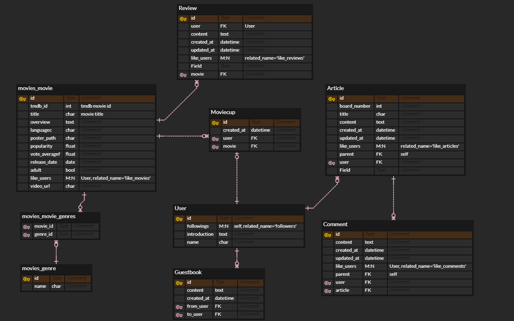

# MovieRand

### 영화 추천, 영화 리뷰 커뮤니티

# 팀원 및 업무 분담

### 오지나

- 영화 추천 알고리즘
1. 좋아요한 영화 기준으로 좋아요, vote_average로 정렬하여 추천
2. 장르별로 인기있는 영화 추천
3. 랜덤 영화 뽑아낸 뒤 정렬하여 추천
- movie
1. 영화 detail 정보 출력
2. 영화 동영상 정보 가져와서 movie 정보에 추가해서 iframe 동영상 출력
3. 영화 월드컵 구현 (16강, 32강)
4. 영화 title, overview 검색 구현 
5. 영화 장르 filter 검색 구현
- community
1. 게시판 나누어 게시글 관리, 목록 출력
2. 게시글, 댓글, 대댓글 CRUD + 좋아요 구현
- profile
1. 로그인유저의 프로필유저 팔로우정보 반영
2. user에 이름, 자기소개 추가할 수 있는 프로필 수정 구현
3. 방명록 구현 (프로필유저가 작성한 것과 다른사람들이 작성한 것 구분하여 출력)
4. user의 좋아요(글, 댓글, 리뷰, 영화) 정보 / 작성한 글, 댓글, 리뷰 출력
5. 프로필페이지 디자인

### 윤선영

- BE
1. axios로 영화 데이터 가져와서 json으로 저장, dump data, load data
2. accounts 기능 구현 - 회원가입, 로그인, 로그아웃
3. 실시간 top20 영화 axios
- FE
1. 메인화면 캐러셀(carousel-3d/vueperslides 라이브러리 활용)
2. 커뮤니티 페이지네이션
3. navBar 라우터
4. Movie Detail페이지 grid system, Card 사용하여 배치
5. click / hover 이벤트
- PPT 제작

# 추천 알고리즘

1. 좋아요 기준 추천
   사용자가 좋아요한 영화를 기반으로 추천해준다. 회원이 좋아요한 영화들을 장르별로 정렬해서 가장 좋아요가 많은 장르를 찾는다. 해당 장르의 영화들 중에 좋아요, vote_average 기준으로 정렬해서 추천한다. 그 다음으로 사용자의 좋아요가 많은 장르에 대해서도 동일하게 추천한다. 좋아요한 영화 정보가 있어야 한다.

2. 장르별 추천
   장르별로 좋아요, popularity 기준으로 정렬해서 30개를 추천한다.

3. TOP20
   axios로 실시간 TOP20 영화 정보를 가져와서 추천한다.

4. 랜덤 추천
   랜덤으로 30개 추천한다.

# 주요 페이지

## Movie

### 1. Main

* TOP20, 추천 영화 캐러셀
* 지금 가장 인기있는 영화를 확인 할 수 있는 3D 캐러셀을 메인으로, 하단에는 랜덤 영화와 장르별 추천 영화를 캐러셀으로 배치했다.

### 2. Movie

* 장르별 영화 추천
* select 체크해서 원하는 장르인 영화만 가져온다. 전부선택하면 모든 영화가 조회된다. 

### 3. Detail

* 영화 정보 디테일
* 영화 정보를 보여주고 동영상이 바로 재생되도록 한다.

### 4. Recommend

* 회원이 좋아요한 영화를 기반으로 추천해준다. 회원이 좋아요한 영화들 중에 가장 많은 장르에서 좋아요, vote_average 기준으로 정렬해서 추천한다.

* 그 다음으로 좋아요가 많은 장르에 대해서도 동일하게 추천한다.

* 좋아요한 영화 정보가 있어야 한다.

### 5. Search

* 검색어를 영화 title에서 출력한 결과와 overview에서 출력한 결과를 모두 보여준다.

### 6. MovieCup

* 랜덤으로 16개 혹은 32개의 영화를 가져와서 선택하도록 한다. 영화가 모두 선택되었을 때 해당 영화의 상세 페이지로 이동한다.
* 최종적으로 선택된 영화는 기록에 저장되고 다음에 moviecup 페이지에 왔을 때 확인할 수 있다. 

## Community

### 1. Article

* 게시판은 자유게시판, 영화추천, 극장정보로 3개로 나누어져있다. 기본 화면은 전체게시글로 특정 게시판을 클릭하면 해당 게시판 내용만 보이도록 한다. 
* 글 작성할때 게시판을 선택할 수 있고, 기본은 자유게시판이다.

### 2. Comment / Recomment

* 게시글에 댓글을 작성하고, 댓글에 좋아요기능이 있다. 댓글의 수정/삭제는 해당 댓글의 작성자에게만 보이도록 한다.
* 댓글에 대댓글을 달수있도록  recomment를 구현했다. comment모델에 parent 필드를 이용해서 parent가 없으면 comment, 있으면 해당 parent comment의 recomment로 인식했다.

### 3. Like

* 게시글, 댓글, 대댓글, 영화리뷰 모두 좋아요 구현했다. 로그인을 했을 때 사용자가 글, 댓글, 리뷰에 대해서 좋아요한 상태인지 확인하고 빨간하트로 표시한다. 
* 좋아요 유무는 하트색으로 표시되고 좋아요 개수도 length를 이용해서 표현했다.

## Profile

### 1. Signup / Login / Logout

* dj-rest-auth 라이브러리를 사용하여, 회원가입/인증/비밀번호 재설정 등을 위한 API 제공받아 회원 정보 관리 기능을 구현하였다.
* 로그인, 회원가입 등의 요청을 처리해줄 url(accounts)은 모두 dj_rest_auth가 갖고 있는 urls가 처리할 수 있도록 했고, 라이브러리로 구현할 수 없는 기능(팔로우, 프로필페이지, 무비컵 등)은 추가로 url을 작성해 처리했다.
* 로그아웃은 state에 저장된 토큰을 초기화 시키는 방법을 사용해 주었다.

### 2. Follow

* 현재 로그인한 사용자 정보가 Profile 유저의 팔로워 목록에 없으면 목록에 추가(팔로우), 있으면 목록에서 삭제(언팔로우)하는 방식으로 팔로우 기능을 구현하였다. 
* 현재 로그인한 사용자 정보가 Profile의 유저 정보와 같지 않으면(토큰으로 구별) 팔로우 버튼을 보이게 하여 팔로우/언팔로우 할 수 있도록 했다.

### 3. 이름, 자기소개

* 가입할때 필수항목이 아니었던 이름과 자기소개를 추가할 수 있다. 프로필수정 페이지에서 입력하면 user정보에 반영되도록 하였다.

### 4. 방명록

* user에 방명록 필드를 추가해서 프로필 페이지 내에서 방명록을 작성할 수 있도록 했다. 프로필 유저가 작성한 방명록과 다른사람들이 작성한 방명록을 구분했다.

### 5. 좋아요 정보

* 해당 프로필 유저가 좋아요한 글, 댓글, 리뷰를 출력했다. user에 like_articles와 같이 related_name으로 접근할 수 있다.

# 데이터베이스 모델링(ERD)

# 목표 서비스 구현 및 실제 구현 정도

### 목표 서비스 구현

movieRand라는 이름처럼 재미있는 영화 추천을 하는 사이트를 만들고 싶었고, 영화 월드컵 기능과 다양한 추천 알고리즘을 구현하고 싶었다.
community 기능도 게시판을 나누어본적은 없기 때문에 게시판을 여러개 만들어보기로 했다. 대댓글까지 구현 목표를 설정했다.
영화에는 좋아요와 별점 기능을 넣고 이를 이용해서 추천알고리즘을 만들고 싶었다.

### 실제 구현 정도

영화월드컵으로 선택해서 해당 영화정보를 담아주는 기능을 구현했고, 영화 좋아요에 따라서 추천알고리즘을 만들었다. 
게시판을 여러개 두고, 전체게시판으로 전체목록을 볼 수 있도록 했다.
대댓글 좋아요까지 구현했다.
영화에 좋아요기능은 구현했지만 별점은 만들지 못했다.

# 소감

### 오지나

django, vue를 따로 익히다가 실질적으로 어떻게 back, front가 연결되는지를 배울 수 있었습니다. 프로젝트를 진행하면서 수많은 오류를 접했고 오류를 해결해나가면서 많이 배운것같습니다. 생각했던 기능들이 구현되는 것이 신기하고 재밌었습니다. 혼자서 하는 것이 아니고 팀원과 함께 하는 프로젝트라 git으로 공유하며 어려움을 느끼기도 했습니다. 처음으로 하는 프로젝트라 프로젝트를 시작하고 준비하는 방법이 가장 막연하게 느껴졌었는데, 이번에 프로젝트를 진행하면서 배운 것들을 통해 다음번에 프로젝트 준비를 조금 더 잘 할 수 있을 것 같다고 생각합니다. 

### 윤선영

처음으로 해 보는 팀 프로젝트였는데, 개인 프로젝트였다면 구현하지 못했을 기능들도 건드려 볼 수 있어서 좋았습니다. 협업 과정에서 Git 사용법을 제대로 알지 못해 시간을 굉장히 많이 잡아먹었는데, 이번 기회를 통해서 git에 대해 확실히 알아 갈 수 있었던 것 같습니다. 추후에 취업을 하더라도 공동으로 작업해야하는 일이 많을텐데, 부족한 부분은 서로 채워가며 함께 일하는 방법을 배울 수 있었던 뜻깊은 일주일이었습니다. 개인적으로 프론트와 백엔드 중에서 고민이 많이 되었었는데, 프로젝트를 진행하다보니 프론트단에서 작업할 때 더 재밌어한다는 점을 발견할 수 있었습니다. 여러모로 힘들지만 좋았습니다 :)

